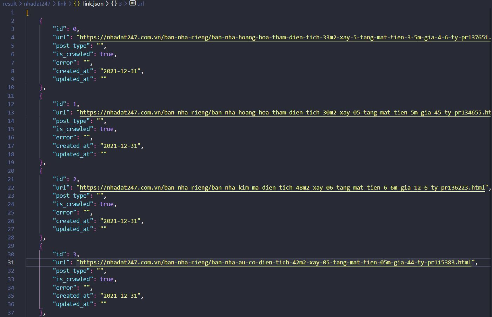
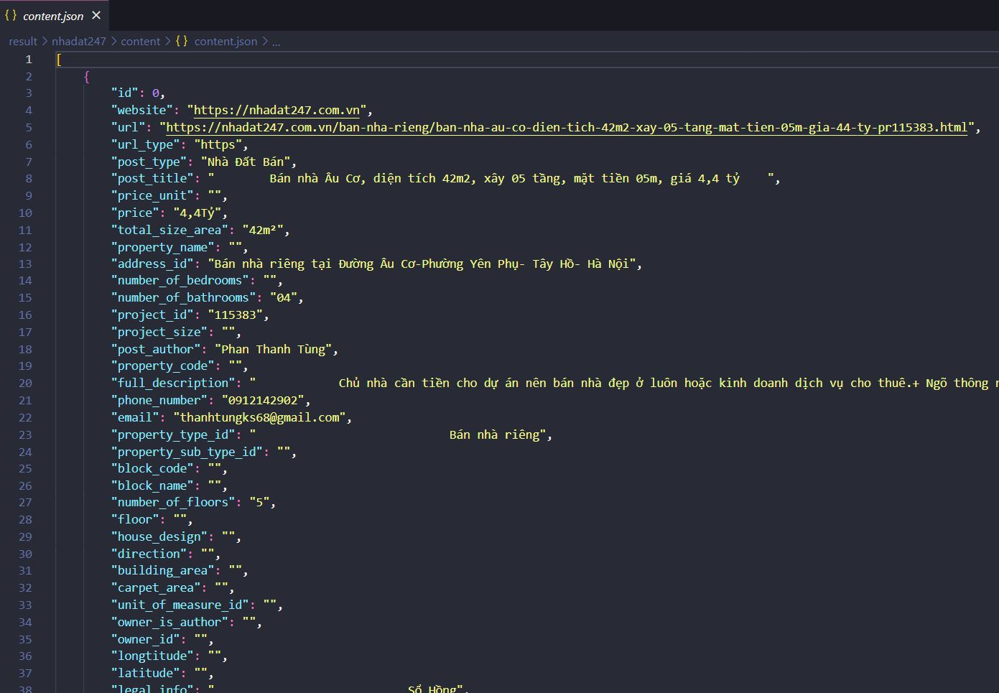

1. Run docker:
```
docker pull scrapinghub/splash
```

```
docker run -p 8050:8050 scrapinghub/splash
```

2. Crawl link --> result in folder: result/(page)/link/link.json
```
scrapy crawl propzy_link
```

```
scrapy crawl nhadat247_link
```

```
scrapy crawl chotot_link
```
Web mogi.vn can't crawl the link

Output in result folder: 



3. Crawl content --> result in folder: result/(page)/content/content.json
```
scrapy crawl propzy_content
```

```
scrapy crawl nhadat247_content
```
```
scrapy crawl mogi_content
```
```
scrapy crawl chotot_content
```

Chotot content is not working well

Output in result folder: 



 
 
